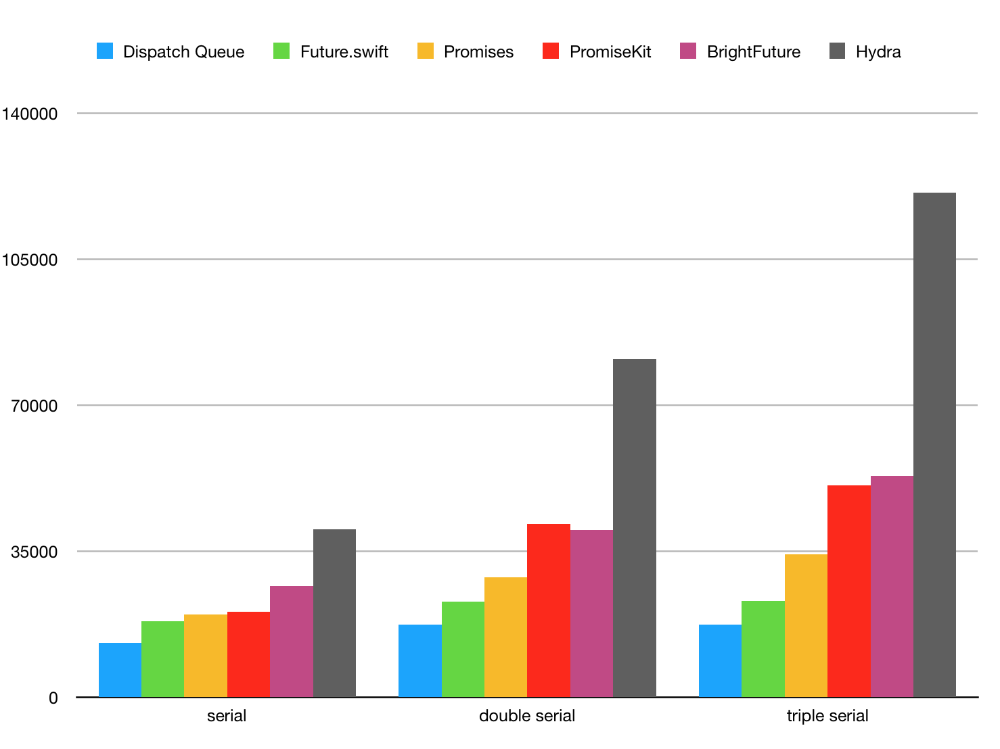
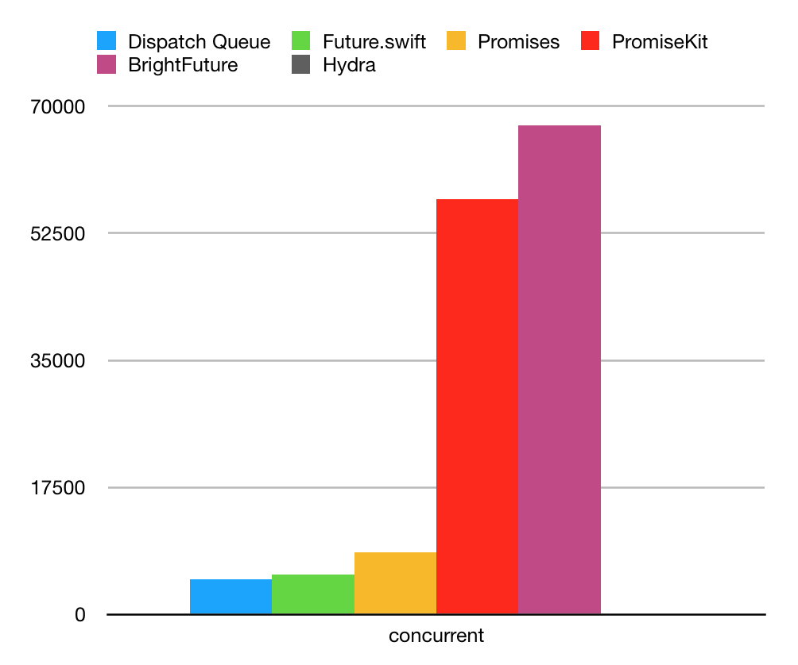

# Future.swift


`Future.swift` is an implementation of [Futures and promises](https://en.wikipedia.org/wiki/Futures_and_promises) for Swift.


## Highlights

- **Normative pattern**
- **Abundant features**
- **Unmatched performance**
- **Pragmatic api**
- **Type safe**

## Benchmark

The performance tests I'm using follows [google/promises](https://github.com/google/promises/blob/master/g3doc/index.md#benchmark). The comparison libraries include [promises](https://github.com/google/promises), [PromiseKit](https://github.com/mxcl/PromiseKit), [BrightFutures](https://github.com/Thomvis/BrightFutures) and [Hydra](https://github.com/malcommac/Hydra). In fact, [promises](https://github.com/google/promises) is implemented in Objective-C, but whatever.

You can see [benchmark/benchmark.xcodeporj](https://github.com/luoxiu/Future.swift/tree/master/benchmark) for more information. 

> Average time in nanoseconds needed to create a resolved promise, chain 1/2/3 blocks and get into the last chained block on a serial queue (measured with 10,000 tries).



> Average time in nanoseconds needed to resolve 10,000 pending promises with chained blocks and wait for control to get into each block on a concurrent queue.



## Usage

`Future.swift`'s api is very friendly, here is a real-wold demo:

```swift
func fetch(_ str: String) -> Future<HTTPResponse, HTTPError> {
    guard let url = URL(string: str) else {
        return .failure(.invalidURL(str))
    }

    let p = Promise<HTTPResponse, HTTPError>()
    URLSession.shared.dataTask(with: url) { (data, response, error) in
        if let e = error {
            p.fail(HTTPError.session(e))
            return
        }
        p.succeed(HTTPResponse(response, data)) 
    } 
    return p.future
}

let img = "https://cdn.io/me.png"
fetch(img)
    .validate {
        $0.status.isValid()
    }
    .userInitiated()
    .tryMap { 
        try ImageDecoder().decode($0.data)
    }
    .main { 
        self.imageView = $0
    }
    .background { 
        cache.add($0, for: img)
    }
    .catch { 
        Log.error($0)
    }
```

`Future.swift`'s core interface is extremely simple, it only has about 7 apis.


### Future

A future represents an eventual result of an asynchronous operation.

- `isPending`: Return true if the future is pending.

- `isCompleted`: Return true if the future is completed.

- `inspect()`: Inspect the future atomically, return nil if the future is pending.

- `inspectRoughly()`: Inspect the future nonatomically, return nil if the future is pending.

- `whenComplete(_ callback: @escaping (Result<Success, Failure>) -> Void)`: Add a callback to the future that will be called when the future is completed.

### Promise

A promise is responsible for managing the state of a future.

```swift
let p = Promise<Result, Error>()

DispatchQueue.background {
    do {
        let r = try task()
        p.succeed(r)
    } catch let e {
        p.fail(e)
    }
}

p.future
```

### Features

`Future.swift` provides 30+ methods to enhance future's capabilities: 

- `always`
- `and`
- `any`
- `asAny`
- `asVoid`
- `catch`
- `delay`
- `done`
- `finally`
- `flat`
- `flatMap`
- `hush`
- `map`
- `mute`
- `pipe`
- `race`
- `recover`
- `reduce`
- `retry`
- `return`
- `some`
- `tap`
- `then`
- `timeout`
- `validate`
- `wait`
- `yield`
- `whenAll`
- `whenAny`
- ... 

Detailed documentation is still being written, if you have good new ideas, welcome to contribute!

## Install

```swift
dependencies: [
    .package(url: "https://github.com/luoxiu/Future.swift", from: "0.0.0")
]
```

## Todo

- [ ] Documentation(Help wanted)
- [ ] Tests(60+% for now)
- [ ] API Reference
- [ ] Release 0.0.1(Hopefully this weekend)
- [ ] [FutureSwiftCommunity](https://github.com/FutureSwiftCommunity)

## License

MIT
